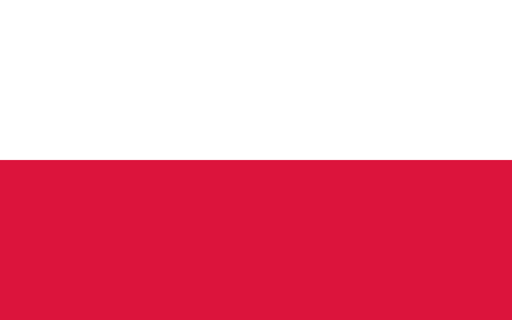

## Hi !

Hello, my name is Stanisław Nieradko.

I'm currently a high-school student, living in  Gdańsk,  Poland.

Since I rembember I'm passionate about new technologies and IT. Thanks to that, I have experience varying from building and reparing computers to setting up and configuring servers. However, despite how interesting these things were, the most interesting for me is **programming**.

## Tools
* C#
    * around :four: years of learning
    * mostly ASP.Net and command line apps
    * Sample Projects:
        * [JedzenioPlanner](https://github.com/JedzenioPlanner/JedzenioPlanner.Api)
        * [eru](https://github.com/xxlo-devs/eru)
        * [Backend to WokLearner](https://github.com/KanarekLife/WokLearner-Backend)
        * [Discord Bot SuperGamblino](https://github.com/SuperGamblino/SuperGamblino)
* :construction_worker: WIP
