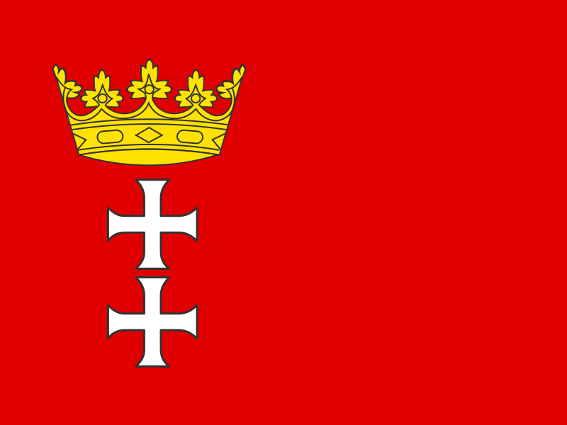

## Siema !

Witaj, nazywam się Stanisław Nieradko.

Jestem uczniem 2 klasy liceum w  Gdańsku.

Odkąd pamiętam moją pasją są nowoczesne technologie i informatyka. Dzięki tym zainteresowaniom miałem styczność z wieloma aspektami tego hobby, zaczynając od składania i konfiguracji komputerów kończąc na zakładaniu i konfiguracji serwerów. Moją największą pasją zostało mimo to **programowanie**.

## Narzędzia
* C#
    * ok. :four: lata nauki
    * głównie ASP.Net oraz aplikacje konsolowe
    * Przykładowe projekty:
        * [JedzenioPlanner](https://github.com/JedzenioPlanner/JedzenioPlanner.Api)
        * [eru](https://github.com/xxlo-devs/eru)
        * [Backend do WokLearner'a](https://github.com/KanarekLife/WokLearner-Backend)
        * [Bot do discord'a SuperGamblino](https://github.com/SuperGamblino/SuperGamblino)
* :construction_worker: WIP