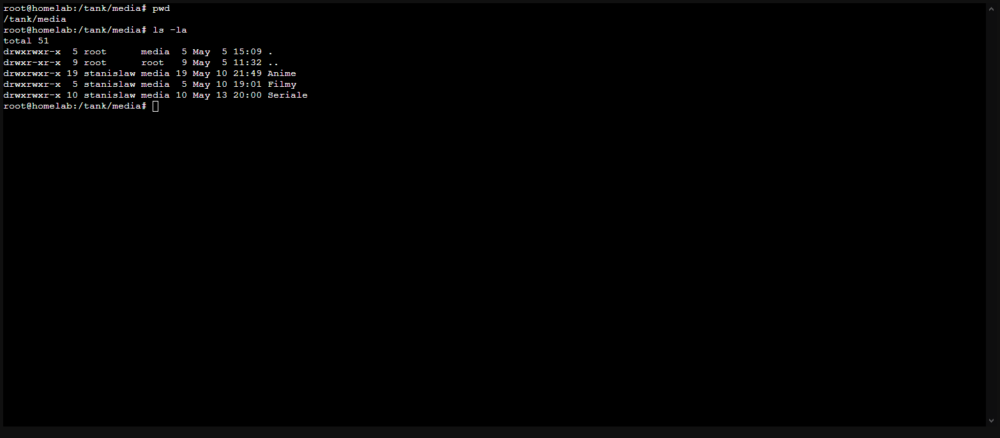
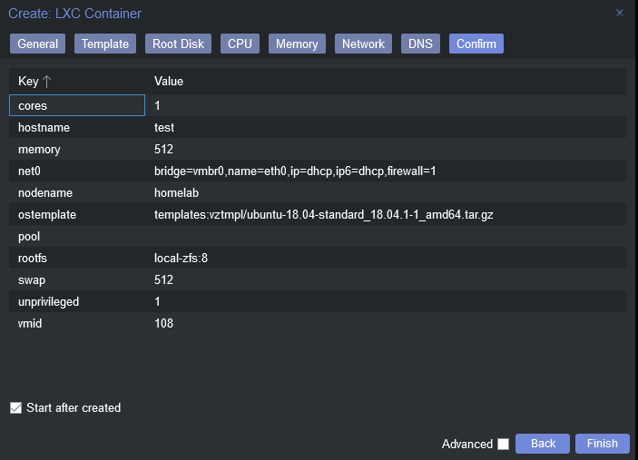
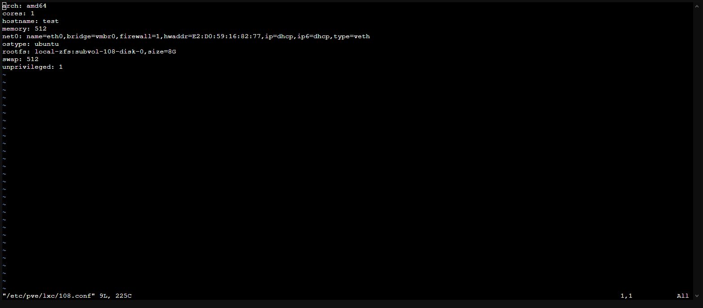
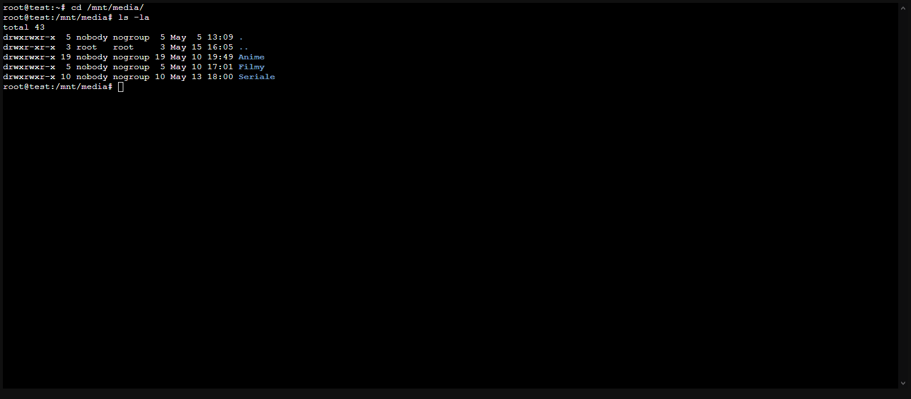
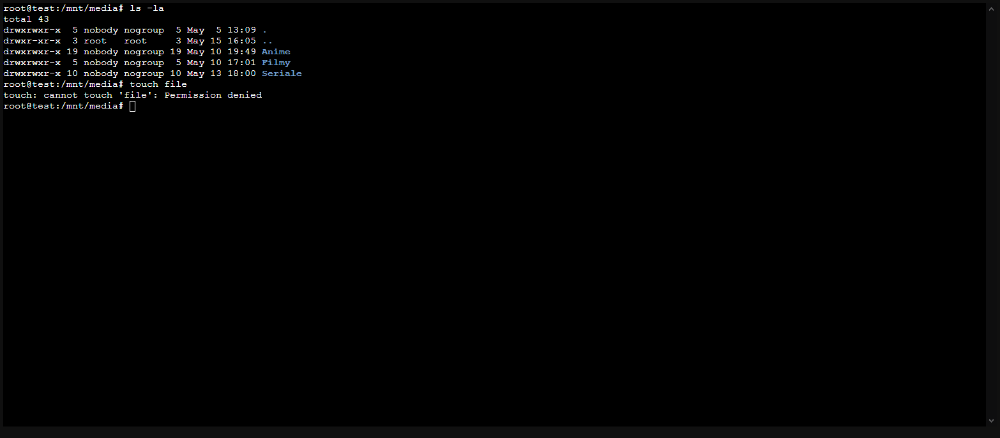
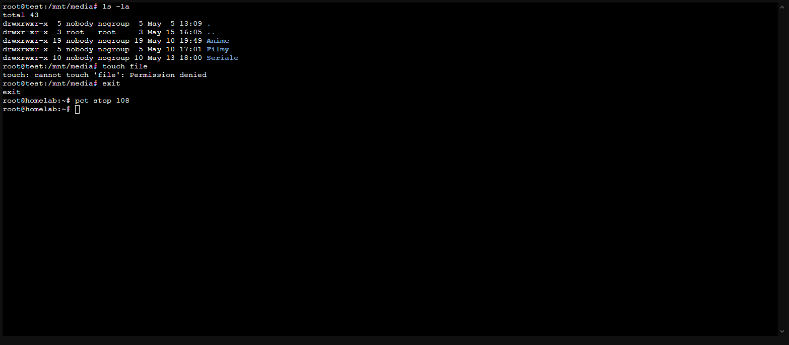
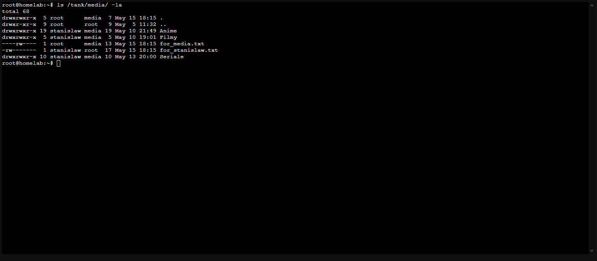
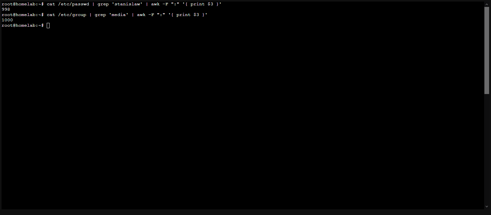
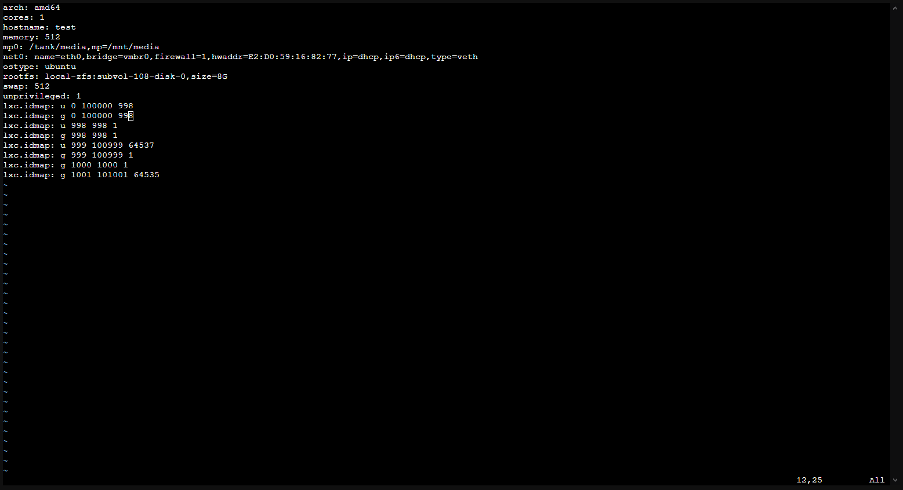

If you don't have time for answers to questions like: "How?" or "Why?", simply jump to []();

## Reasons and introduction

Lately, I've been setting up my new homelab server.

While picking up the parts, I knew that, performance-wise, it is not going to be a beast. To buy it as cheaply as possible while still making it possible to run all of the services I wanted, I've finally settled with Intel Core I5-8400T. Even though I'm a fan of Ryzen CPUs, and I would choose them any time over intel CPUs, in my case, the intel was a king. The GPU prices are as high as they can be, making it impossible to buy both GPU and CPU for a cheap homelab build.

One of the tasks that would be too heavy for my CPU is running many VMs.

I know you'll ask: 

> "Why are you installing proxmox then? Wouldn't it be better to simply throw an ubuntu server and docker over it?"

Yeah, you're probably right, but I wanted to experiment with proxmox and learn as much of it as possible. The solution that I've chosen is running everything via LXC containers. The reasons for it will probably make a great post, so I probably will make one in the future.

## LXC Security and Unprivilidged Containers

If you plan to pass directories or devices to your LXC there are basically two ways:

1. Unpriviliged container
2. Priviliged container with LXC mapping

The latter is way more secure. Why? Well, the first one automatically pass all of the host's users and groups, meaning that root of container (uid=0) will be able to act as host's root (uid=0). That is not secure, at all. Most of exploits allowing to escape LXC is based around that idea and therefore I do not suggest using it in production. Now after that lengthly introduction, let's jump into practise.

## Mounting directory into LXC container

First I will prepare a directory that I will be mounting into new container. As an example I will be mounting directory located at `/tank/media` into `/mnt/media` inside new container. Let's make sure that our host machine do, indeed, have directory present.



Note that the directory is accessible to all users belonging to `media` group.

Now let's create new, simple, unpriviliged container in proxmox web ui.



After a while our container will be ready to use. Before jumping in, it's time to mount our directory to LXC container.

Connect to your host via SSH or use web-console and open `/etc/pve/lxc/{id_of_your_ct}.conf` file with your favourite editor. In my example the command will be: `vim /etc/pve/lxc/108.conf`.



In order to mount directory from host to mounting point in container add a line like that in container's configuration file:

```
mp0: /tank/media,mp=/mnt/media # /tank/media in host -> /mnt/media in container
# mp1: /sample/directory,mp=/sample/directory # /sample/directory in host -> /sample/directory in container
# mp2: /sample/directory,mp=/sample/directory # /sample/directory in host -> /sample/directory in container
# etc.
```

Each line corresponds to another mouting. For more details checkout [this official proxmox wiki's page on this subject](https://pve.proxmox.com/wiki/Linux_Container#_bind_mount_points).

Now exit the editor and restart your container:

```sh
pct stop {id_of_your_ct} # pct stop 108
pct start {id_of_your_ct} # pct start 108
```

As you can see our folder is accessible from the container. 



There's only one issue. Due to having our container set up as unpriviliged container we cannot do anything with our directory provided that permissions do not specify that other user can do so.



How to fix it? It's time for...

## Mapping permissions for LXC containers

Let's head back into our host commandline and stop our container.



Firstly we need to get ids of users and groups that we want to pass to our LXC container. As an example, let's say that we want to be able to access files available only for user `stanislaw` and files available only for users in group `media`. Let's create these files:

```sh
# File only for stanislaw
touch /tank/media/for_stanislaw.txt
echo "Hello stanislaw!" > /tank/media/for_stanislaw.txt
chmod 600 /tank/media/for_stanislaw.txt
chown stanislaw /tank/media/for_stanislaw.txt

# File for users in media group
touch /tank/media/for_media.txt
echo "Hello media!" > /tank/media/for_media.txt
chmod 060 /tank/media/for_media.txt
chgrp media /tank/media/for_media.txt
```



Now we need to take note of the ids both of user `stanislaw` and group `media`:

```sh
# Retrieve id of user
cat /etc/passwd | grep '{user name}' | awk -F ":" '{ print $3 }'
# cat /etc/passwd | grep 'stanislaw' | awk -F ":" '{ print $3 }' -> 998

# Retrieve id of group
cat /etc/group | grep '{group name}' | awk -F ":" '{ print $3 }'
# cat /etc/group | grep 'media' | awk -F ":" '{ print $3 }' -> 1000
```



Now let's open again the configuration file of your container (`/etc/pve/lxc/108.conf`) and add these lines:

```
lxc.idmap: u 0 100000 998
lxc.idmap: g 0 100000 998
lxc.idmap: u 998 998 1
lxc.idmap: g 998 998 1
lxc.idmap: u 999 100999 64537
lxc.idmap: g 999 100999 1
lxc.idmap: g 1000 1000 1
lxc.idmap: g 1001 101001 64535
```



I'll come back to these intructions in a minute to explain how to get these lines for your own ids.

Now let's start the container and navigate to `/mnt/media` again.

```bash
root@test:~# cd /mnt/media/
root@test:/mnt/media# ls -la
total 60
drwxrwxr-x  5 nobody    1000  7 May 15 16:15 .
drwxr-xr-x  3 root   root     3 May 15 16:05 ..
drwxrwxr-x 19    998    1000 19 May 10 19:49 Anime
drwxrwxr-x  5    998    1000  5 May 10 17:01 Filmy
drwxrwxr-x 10    998    1000 10 May 13 18:00 Seriale
----rw----  1 nobody    1000 13 May 15 16:15 for_media.txt
-rw-------  1    998 nogroup 17 May 15 16:15 for_stanislaw.txt
root@test:/mnt/media# 
```

As we can see container now is able to correctly remap... WIP